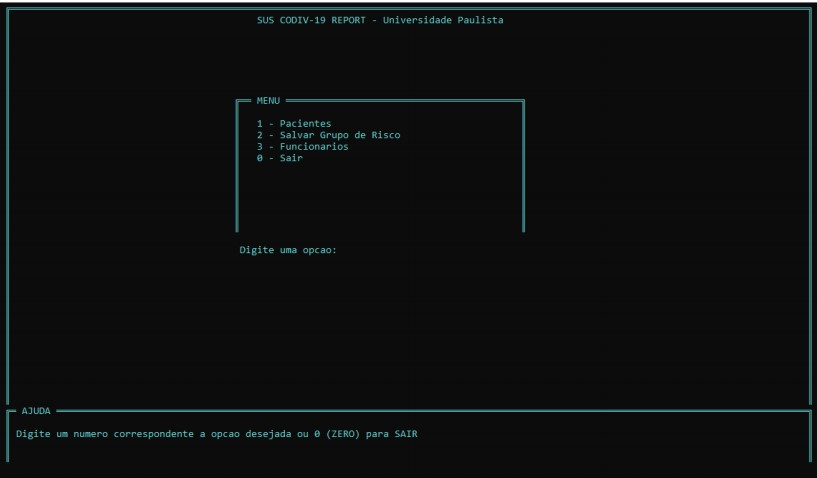

# SUS COVID19 Report
 Sistema em C para registro de pacientes com COVID-19 e geração de grupo de risco (UNIP - Universidade Paulista)  

  

 **Requisitos**  

 CodeBlocks - [Baixe aqui](http://sourceforge.net/projects/codeblocks/files/Binaries/20.03/Windows/codeblocks-20.03mingw-setup.exe)  

**Como compilar**  
Simplesmente abra o Codeblocks, vá no menu **File** > **Open...**  
E selecione o arquivo do projeto **covid19Report.cbp**  
Depois de abrir o arquivo do projeto, pressione **F9** para compilar e executar   